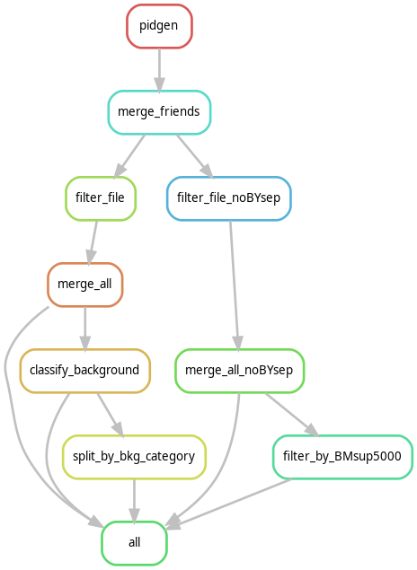

Workflow to add PIDGen information to RDs ntuple
================================================

Use the apd package to get the list of files from the SL Hadronic_RDs analysis production:
https://lhcb-analysis-productions.web.cern.ch/productions/?wg=sl&analysis=rds_hadronic

Should be run using the LHCb *lb-conda default/2023-04-26* environments 
(it switches to the *pidgen* environment to actually process the data)

To run:
```
snakemake -j X
```
depending on the number of cores to be used X.

the file *config/config.json* can be customized to specify the temporary storage and where to write the output.


Structure
---------

Based on the analysis production, this workflow
- adds corrected kinematic quantities with PIDGen, using `workflow/scripts/pidgen2_rds_hadronic.py`
- creates extra variables needed for the analysis, applies the BDTs Bs, Ds and 3pi, BDT_Iso and filters the data, using `workflow/scripts/RDsProcess.C`
  - the weight files for the BDTs are:
    - `TMVA/TMVAClassification_BDT_3pi_new_PID.weights.xml`
    - `TMVA/TMVAClassification_BDT_Ds_new_PID.weights.xml`
    - `TMVA/TMVAClassification_BDT_Bs_new_PID.weights.xml`
  - for the BDT_Iso the weight file are `TMVA/TMVAClassification_nc_020_[...].xml`
- apply code to categorise the candidates using the logic implemented in `categories4.py`, using the `add_categorization.py` script.

The workflow is organized as a Snakemake workflow, defined in `workflow/Snakefile`, with the following rules
defined in the workflow:




There are two versions of the processing scripts, one that applies a  B_Y_SEP cut `RDSProcess.C`, and one that does not: `RDsProcess_noBYsep.C` (without the cut the Ntuples were very large).